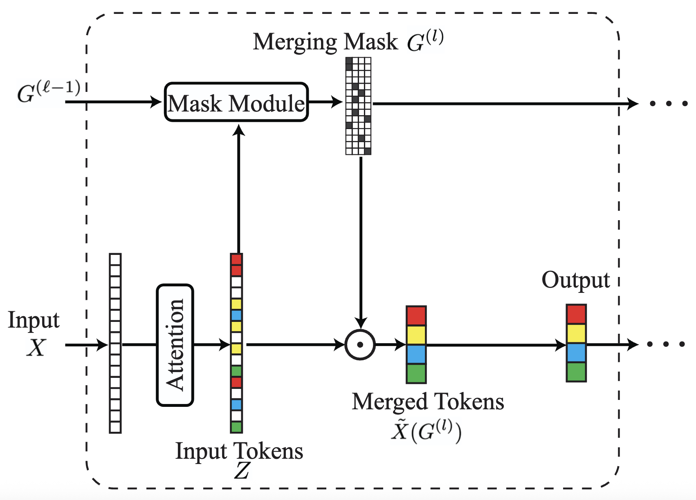
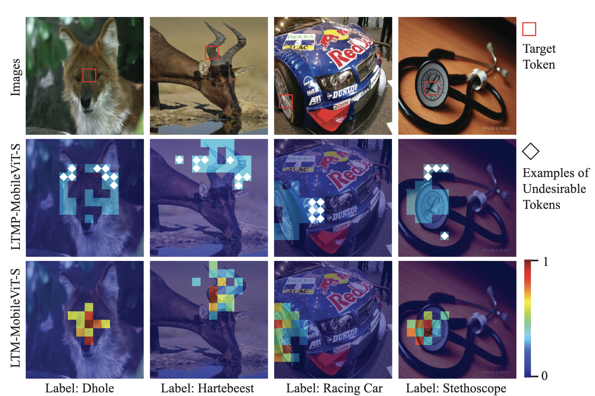

# Efficient Visual Transformer by Learnable Token Merging
PyTorch implemention of Efficient Visual Transformer by Learnable Token Merging. 


### Learnable Token Merging (LTM)




we propose a novel and compact transformer block, Transformer with Learnable Token Merging (LTM), or LTM-Transformer. LTM-Transformer performs token merging in a learnable scheme. LTM-Transformer is compatible with many popular and compact transformer networks, and it reduces the FLOPs and the inference time of the visual transformers while maintaining or even improving the prediction accuracy. In the experiments, we replace all the transformer blocks in popular visual transformers, including MobileViT, EfficientViT, ViT, and Swin, with LTM-Transformer blocks, leading to LTM-Transformer networks with different backbones. The LTM-Transformer is motivated by reduction of Information Bottleneck, and a novel and separable variational upper bound for the IB loss is derived. The architecture of the mask module in our LTM blocks, which generates the token merging mask, is designed to reduce the derived upper bound for the IB loss. Extensive results on computer vision tasks evidence that LTM-Transformer renders compact and efficient visual transformers with comparable or much better prediction accuracy than the original visual transformers. 

### Effectiveness of LTM



Comparisons of token merging weights generated in the first transformer block in LTM-MobileViT-S and LTMP-MobileViT-S. The target tokens resulting from the token merging process are marked with red boxes in the first row. The token merging weights for tokens merged into the target tokens by LTMP-MobileViT-S are illustrated in the second row.
The token merging weights for tokens merged into the target tokens by LTM-MobileViT-S are illustrated in the third row. Tokens that are more semantically similar to the target tokens should receive higher merging weights so as to achieve informative token merging. Examples of the undesirable tokens, which are not semantically similar to the target tokens, are marked with white diamonds. In contrast with LTMP, the heatmaps of the merging weights generated by LTM illustrate that LTM usually assigns larger weights to tokens that are more semantically similar to the target tokens.

### Requirements

``````
 - python >= 3.8
 - pytorch >= 1.12.1  
 - torchvision       
 - timm >= 0.4.12                
``````

### Results

**Train-from-Scratch**

| Model                              | # Params | FLOPs | Top-1 |
|-----------------------------------|----------|--------|--------|
| MobileViT-XS                      | 2.3 M    | 0.7 G  | 74.8   |
| ToMe-MobileViT-XS                | 2.3 M    | 0.54 G | 72.7   |
| ToFu-MobileViT-XS                | 2.3 M    | 0.54 G | 73.3   |
| LTMP-MobileViT-XS                | 2.3 M    | 0.56 G | 73.9   |
| **LTM-MobileViT-XS (Ours)**       | 2.3 M    | 0.52 G | **75.8** |
| MobileViT-S                       | 5.6 M    | 1.4 G  | 78.4   |
| ToMe-MobileViT-S                 | 5.6 M    | 1.22 G | 76.7   |
| ToFu-MobileViT-S                 | 5.6 M    | 1.22 G | 77.2   |
| LTMP-MobileViT-S                 | 5.6 M    | 1.26 G | 77.5   |
| **LTM-MobileViT-S (Ours)**        | 5.6 M    | 1.17 G | **79.7** |
| EfficientViT-B1 [r224]           | 9.1 M    | 0.52 G | 79.4   |
| S²ViTE-EfficientViT-B1 [r224]     | 8.2 M    | 0.47 G | 79.0   |
| SPViT-EfficientViT-B1 [r224]      | 9.2 M    | 0.49 G | 79.3   |
| SAViT-EfficientViT-B1 [r224]      | 8.4 M    | 0.47 G | 79.2   |
| ToMe-EfficientViT-B1 [r224]      | 9.1 M    | 0.47 G | 78.8   |
| ToFu-EfficientViT-B1 [r224]      | 9.1 M    | 0.47 G | 79.0   |
| LTMP-EfficientViT-B1 [r224]      | 9.1 M    | 0.50 G | 79.2   |
| **LTM-EfficientViT-B1 [r224] (Ours)** | 9.1 M | 0.44 G | **80.2** |
| EfficientViT-B1 [r288]           | 9.1 M    | 0.86 G | 80.4   |
| ToMe-EfficientViT-B1 [r288]      | 9.1 M    | 0.73 G | 79.7   |
| ToFu-EfficientViT-B1 [r288]      | 9.1 M    | 0.73 G | 79.8   |
| LTMP-EfficientViT-B1 [r288]      | 9.1 M    | 0.76 G | 80.0   |
| **LTM-EfficientViT-B1 [r288] (Ours)** | 9.1 M | 0.70 G | **81.0** |
| ViT-S                             | 22.1 M   | 4.3 G  | 81.2   |
| **LTM-ViT-S (Ours)**              | 22.1 M   | 3.7 G  | **81.8** |
| ViT-B                             | 86.5 M   | 17.6 G | 83.7   |
| **LTM-ViT-B (Ours)**              | 86.5 M   | 12.9 G | **83.9** |
| Swin-T                            | 29.0 M   | 4.5 G  | 81.3   |
| **LTM-Swin-T (Ours)**             | 29.0 M   | 3.8 G  | **81.8** |
| Swin-B                            | 88.0 M   | 15.4 G | 83.5   |
| **LTM-Swin-B (Ours)**             | 88.0 M   | 12.0 G | **83.8** |

**Demo Run**

Distributed Training on 4 GPUs

``````
./distributed_train.sh 4 'your-data-path' --model ltm_mobilevit_s \
-b 64 --workers 8 --pin-mem \
--sched cosine --epochs 300 --min-lr 0.00002 --lr 0.0002 --warmup-lr 0.0002 --warmup-epochs 5 \
--opt adamw --weight-decay 0.01 \
--model-ema --model-ema-decay 0.9995 \
--aa rand-m9-mstd0.5 --remode pixel --reprob 0.2 --amp \
--smoothing 0.1 \
--checkpoint-hist 20 \
--compression-ratio 0.8 \
--output 'your-output-path-saving-results' \
``````


